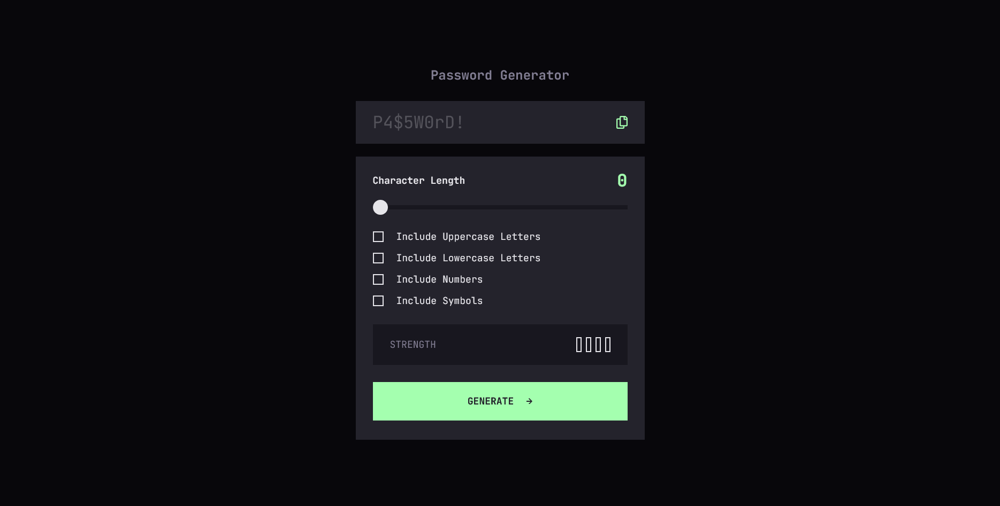
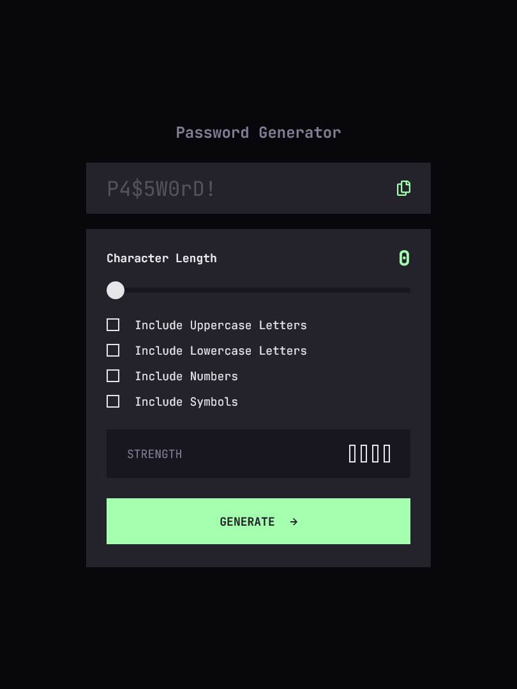
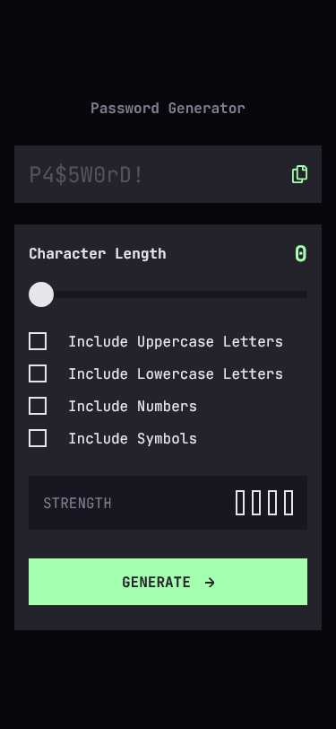

# Frontend Mentor - Password generator app solution

This is a solution to the [Password generator app challenge on Frontend Mentor](https://www.frontendmentor.io/challenges/password-generator-app-Mr8CLycqjh). Frontend Mentor challenges help you improve your coding skills by building realistic projects.

## Table of contents

- [Overview](#overview)
  - [The challenge](#the-challenge)
  - [Screenshot](#screenshot)
  - [Links](#links)
- [My process](#my-process)
  - [Built with](#built-with)
  - [What I learned](#what-i-learned)
  - [Continued development](#continued-development)
  - [Useful resources](#useful-resources)
- [Author](#author)
- [Acknowledgments](#acknowledgments)

## Overview

### The challenge

Users should be able to:

- Generate a password based on the selected inclusion options
- Copy the generated password to the computer's clipboard
- See a strength rating for their generated password
- View the optimal layout for the interface depending on their device's screen size
- See hover and focus states for all interactive elements on the page

### Screenshot

#### Desktop

#### Tablet

#### Mobile

### Links

- Solution URL: [https://github.com/PetarR21/password-generator-app](https://github.com/PetarR21/password-generator-app)
- Live Site URL: [https://password-generator-app-olive.vercel.app/](https://password-generator-app-olive.vercel.app/)

## My process

### Built with

- Semantic HTML5 markup
- CSS custom properties
- Flexbox
- CSS Grid
- [React](https://reactjs.org/) - JS library
- [Tailwind CSS](https://tailwindcss.com/) - For styling

### What I learned

I learned a lot in this challange.

Frist and foremost, I learned how to create custom range input, and custom checkboxes. I struggled a lot with these, and it was in a way a humbling experience, beacuse I saw how much more I have to learn.

I also learned how to use these custom inputs to generate a password based on selected options.

### Continued development

I would like to continue improving. I also want to explore more advanced CSS techniques for styling and layout, and to find a way to make the code more modular and reusable.

Also, I would like to improve my code in the future so it is more clean and simple.

### Useful resources

- [Change Color of SVG on Hover](https://css-tricks.com/change-color-of-svg-on-hover/) - This helped me with styling SVGs.
- [Get started with Tailwind CSS](https://tailwindcss.com/docs/installation/using-vite) - It is my first project, using Tailwind, so official docs were pretty helpful.

## Author

- Frontend Mentor - [@PetarR21](https://www.frontendmentor.io/profile/PetarR21)
